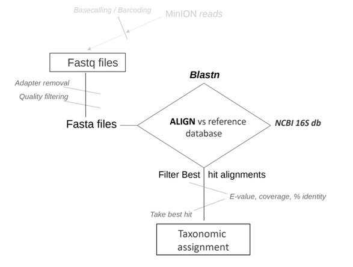

The  **16S_ppm pipeline** is an accompanying set of scripts for the paper *“A computational strategy for rapid on-site 16S metabarcoding with Oxford Nanopore sequencing”* (manuscript in preparation; preprint available at https://doi.org/10.1101/2020.08.25.267591). Author: Stefano M. Marino, PhD

## Overview

The Oxford Nanopore Technologies (ONT) MinION sequencer, is a portable and affordable device, that produces long reads. Its application is well suited for *in situ* sequencing, e.g. for field work, analyzing environmental samples. One of the most common approaches in this area is the analysis of the 16S rRNA gene (a trademark of prokaryotes), known as 16S metabarcoding. The  16S_ppm pipeline, available here is specifically tailored to ONT long reads in 16S metabarcoding. The general structure of the 16S_ppm work-flow is shown in the following scheme. 

 

## Quick start-up: Usage
The 16S_ppm pipeline can run in two mods: 
*(i)* from nucleotide sequences (in fasta format); it returns the taxonomic classification (output folder: inputname_results_fromfasta) 
*(ii)* from nucleotide sequences with quality scores (in fastq format); it returns the taxonomic classification (output folder: inputname_results_fromfasta) \
*(iii)* from the raw sequencing files (fast5, as obtained from the MinION sequencer); it includes basecalling, and proceeds to taxonomic descriptions.

To run *(i)*: 
#### python run_from_fastA.py input.fasta    
To run *(ii)*: 
#### python run_from_fastQ.py input.fastq   
To run *(iii)*:
#### python run_with_basecall.py path_to_fast5_folder 
  (e.g. python run_with_basecall.py /home/MinION/my_fast5_folder)

Once the 16S_ppm folder is downloaded (e.g. in /home/user/, creating a working folder /home/user/16S_ppm) the pipeline should be ready to run (if not, check all scripts have permissions to run; else, set with chmod -R).

### Requirments
Python 3 (3.4 or newer)
Python 2 (2.7 or newer)
Blastn 2.9.0 (or newer)

### Optional dependencies 
Guppy, Porechop, Filtlong (or Nanofilt). 

Nanofilt (version 2.5.0, or newer) or Filtlong (v0.2.0, or newer) are used for fastq filtering (quality of reads, minimum length); Porechop, for adapter removal. 
They contribute to the pipeline only if you wish to filter reads (by quality and size and/or barcode sequence removal) after basecalling and before classification; this step is not necessary. These programs are available at Porechop (https://github.com/rrwick/Porechop) and Filtlong (https://github.com/rrwick/Filtlong); if you don't have these two programs already installed, binaries of Porechop and Filtlong (both with GNU licences) are provided with this distribution (in bin subfolder, with paths accordingly set in the configuration file); blastn (with its NCBI license) executable is also included (in bin subfolder). These programs should work "out of the box" (if activated; see configuration file, below).
\
Instead, Guppy must be installed by the user, and its path accordingly specified in the configuration file (configuration.cfg). If you do not have access to fast5 file (raw sequencing data, before basecalling) you do not need guppy (and can skip the following paragraph). If you want to run the analysis from the raw sequencing data, you need to have access to Guppy (ONT proprietary basecaller). 
If you are a registered ONT user and have access to the ONT community, a simple solution is to donwload Guppy binaries and move (or copy) the ont-guppy-cpu folder (containing all Guppy scripts and data) in the 16S_ppm/bin subdirectory (where other dependencies are; e.g. 16S_ppm/bin/ont-guppy-cpu/): in this case, no change is needed to the configuration file (as it points to bin subfolder, by default). Else, edit the configuration file accordingly, with your guppy folder path; e.g. /usr/bin/ont-guppy-cpu/). If you
\
An open source alternative for ONT basecall is Chiron (https://github.com/haotianteng/Chiron). In this case, run the basecaller separately, and then use run_from_fasta.py on the basecalled reads.
The pipeline was tested on Ubuntu 14.04 LTS (mainly) and 16.04 LTS.

### Configuration file 
The analysis can be customized via the configuration file ("configuration.cfg", in the root folder of 16S_ppm). This file is meant to configure a "ready to go" pipeline.\
The options are important to tailor the search: for instance, the blast searches can be significantly customized, with max target options, e-value, coverage, etc. Similarly the quality filtering of reads, can be adjusted for strict or relaxed (or deactivated). Additionally, the number of fasta sequences to be classified can be set to a specific value: by default, the run_with_basecall.py script considers 20,000 fasta sequences for each barcode; this is set by the max_num_fasta parameter. The 20,000 choice allows for fast investigations: the pipeline can start while the sequencing is running, and provide the first results within few hours from the start of the MinION run (depending on the number of samples, i.e. number of barcodes). The pipeline was developed with the goal to perform rapid evaluations, e.g. in the field and on a standard (mid-range) laptop: thus, the default set up employs a parameterization scheme specifically optimized for this task. The parameters can be adjusted for different needs, including long and comprehensive calculations; it has to be noted that pushing the parameters toward more extensive searches, can significantly impact the run-time, and, in case of a standard laptop, the available computational resources. This is particularly true for some parameters, e.g.  max_t  (suggested range:  5 ≤ value  ≤ 75) and max_num_fasta (suggested range:  20,000 ≤ value ≤ 100,000). A combination of the two such as max_t=75 and max_num_fasta = 150,000 could be considered (indicatively) as a borderline scenario (more “expensive” values, will  be better suited for a server calculation, or high-end workstations). On the other hand, with max_t=5 and max_num_fasta=20,000 (for quick, albeit less accurate calculations) the analysis can run also on low-end/old notebooks.
The list of options available in the configuration file are detailed below (after "----->" comments for this document, not present in the cfg file). 
\
\
*num_threads=8*  -----> number of threads used 
\
*guppy_dir=/home/user/ont-guppy-cpu/*       -----> path to main guppy dir (the path for /bin, and /data)
\
*guppy_fast_mode=ON*       -----> set to guppy_fast_mode=OFF for hac mode (note: marginally more accurate with 16S, but MUCH slower)
\
*porechop_runner=bin/Porechop/porechop-runner.py*      -----> path for porechop-runner (in 16S_ppm/bin subfolder)
\
*porechop=0*   -----> activate porechop (0= NOT active; 1= run porechop)
\
*Nanoflt_runner=/home/user/bin/NanoFilt* -----> path for Nanofilt, if installed
\
*Filtlong_runner=bin/Filtlong-master/bin/filtlong*	-----> path for Filtlong (in 16S_ppm/bin subfolder), runs automatically if Nanofilt is not found
\
*Nanofilt=0*	  -----> activate Nanofilt OR Filtlong (0= NOT active; 1= run Nanofilt OR Filtlong)
\
*Q_filt=7*		  -----> quality filtering for fastq reads 
\
*L_filt=800*	  -----> length filtering for fastq reads
\
*max_num_fasta=20000*   -----> max number of fasta reads (per barcode) used for taxonomic analysis
\
*min_num_fasta=1*   -----> min number of fasta reads for taxonomic analysis (e.g. if set to 100, will not consider barcodes with 								     less than 100 reads assigned to it)
\
*db=bin/NCBI_16S_db/PRJNA33175_Bacterial_16S.fasta* -----> path for database (db) provided with this distribution
\
*blastn="bin/ncbi-blast-2.9.0+/bin/blastn"* -----> path for blastn provided with this distribution
\
*max_t=5*	-----> max target sequences option for blast searches (see Blast documentation); set to 0, for unrestricted blast (max_t=0)
\
*evalue=0.00001*	-----> evalue cut of for blastn
\
*align_coverage_cutoff=0* -----> filter alignments for coverage > cutoff (e.g. if =60, filters out align <60% coverage)		
\
*align_perc_id_cutoff=0* -----> filter alignments for %identity > cutoff (e.g. if =70, filters out align <70% identity)

